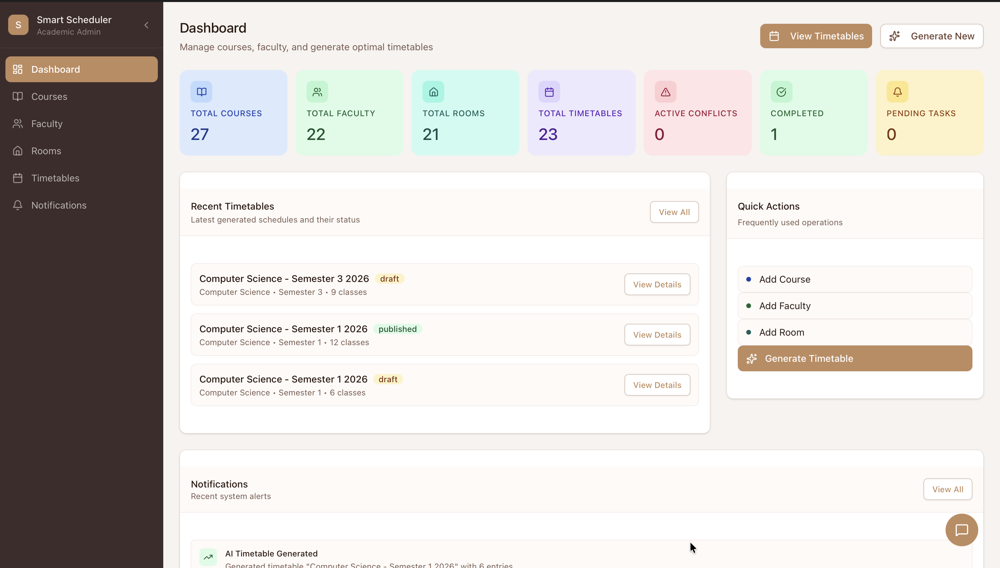
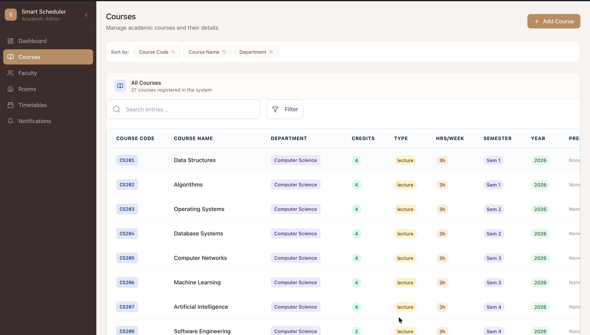
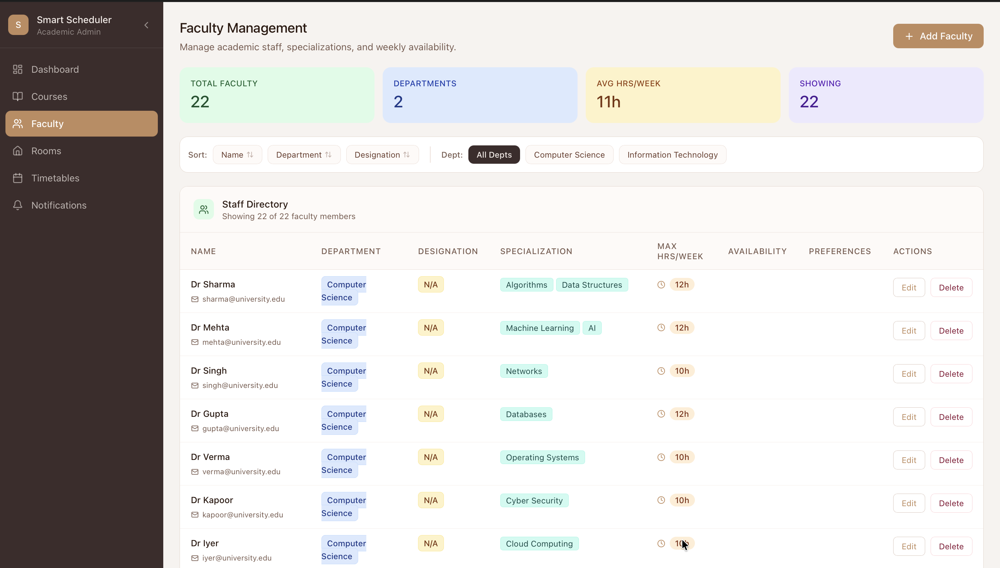
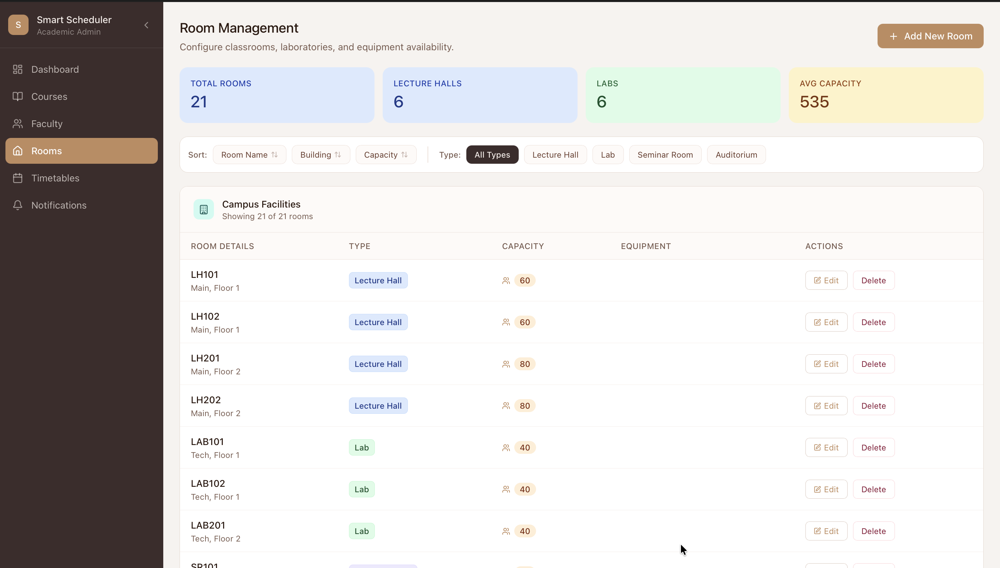
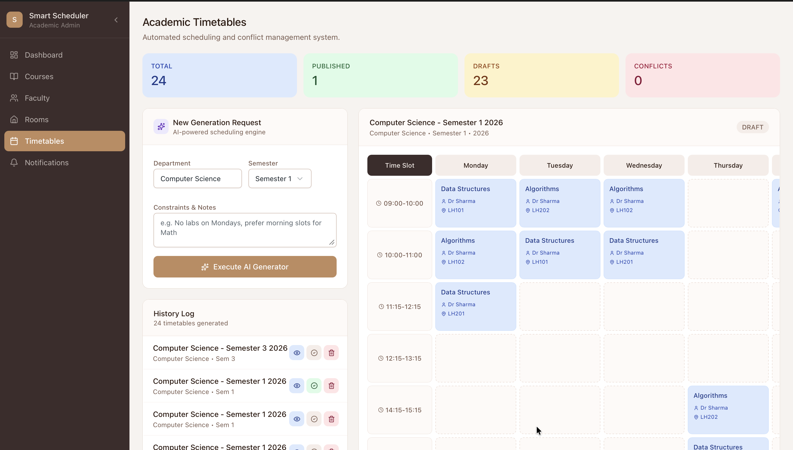
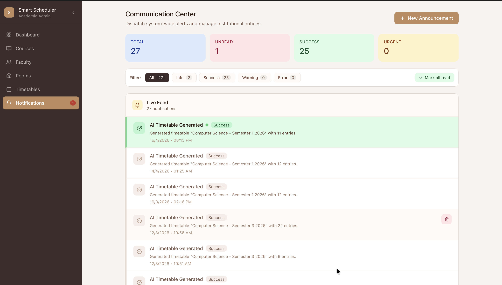

<div align="center">

# 🎓 IntelliSched
### AI-Driven Smart Classroom Timetable Generator

**Automate university scheduling in seconds — zero conflicts, zero hassle.**

[](https://nodejs.org/)
[](https://reactjs.org/)
[](https://www.mongodb.com/)
[](https://expressjs.com/)
[](https://tailwindcss.com/)
[](https://groq.com/)
[](https://vercel.com/)
[](LICENSE)
[]()

[Overview](#-overview) · [Features](#-features) · [Tech Stack](#-tech-stack) · [Architecture](#-project-structure) · [Setup](#️-installation--setup) · [Usage](#️-usage) · [Screenshots](#-screenshots) · [Roadmap](#-future-improvements)

</div>

---

## 🚀 Overview

Building a university timetable by hand is an administrative nightmare. Schedulers must simultaneously balance faculty availability and specializations, room capacities, weekly session requirements, and mandatory break periods — across dozens of courses and instructors. One oversight causes cascading conflicts.

**IntelliSched eliminates this entirely.**

It combines a clean React dashboard with a Groq-powered LLM backend (LLaMA 3.3 70B) to generate complete, conflict-free weekly timetables in one click. Administrators manage their academic data through an intuitive UI, trigger the AI generator, and receive a validated, ready-to-use schedule — in seconds.

**Real-world relevance:** Universities, colleges, and coaching institutes that still rely on spreadsheets or manual processes can replace hours of scheduling work with a single button press.

---

## ✨ Features

### 🤖 AI-Powered Timetable Generation
- Generates complete weekly timetables using **LLaMA 3.3 70B via Groq**
- Matches faculty to courses based on **specialization** — never misassigns instructors
- Guarantees **zero conflicts** across faculty, rooms, and time slots
- Respects institutional constraints: break periods, session frequencies, room types

### 🌦️ Weather-Based Class Cancellation *(New Feature)*
> **Automatically cancels classes and notifies everyone when the weather turns bad.**

IntelliSched integrates with the **OpenWeatherMap API** to run a daily automated weather check at **7:00 AM IST** via a Vercel Cron job. If the system detects rain, thunderstorms, or drizzle in the configured city, it:
- **Automatically creates a cancellation notification** in the system
- **Flags the alert as a warning** so it surfaces prominently in the Notifications dashboard
- Requires zero manual intervention from administrators

This is especially critical for campuses in monsoon-heavy regions where weather disruptions are frequent and last-minute announcements cause confusion. The module is fully configurable — set your city, country code, and API key via environment variables, and the system handles the rest.

**How it works under the hood:**
```
Vercel Cron triggers GET /api/weather-check at 01:30 UTC (07:00 IST)
        ↓
weatherCheck.js calls OpenWeatherMap API for the configured city
        ↓
If condition is Rain / Thunderstorm / Drizzle:
  → Creates a 'warning' Notification in MongoDB
  → Message: "Due to rainy weather in [City], all classes are cancelled today."
If weather is clear:
  → Logs "No notification needed" — no noise
```

### 📊 Admin Dashboard
- Live stats: total courses, faculty, rooms, and timetable entries
- Collapsible sidebar for a distraction-free workflow
- Real-time data visualization powered by MongoDB

### 💬 AI Chatbot Assistant
- Built-in chatbot component for in-app help and queries

### 📚 Course Management
- Add, edit, and delete courses
- Configure credits, department, semester, weekly hours, and course type (lecture / lab / seminar)

### 👨‍🏫 Faculty Management
- Manage instructors with specializations
- Set maximum weekly hours and course assignments

### 🏫 Room Management
- Track classrooms and labs with capacity, type, and available equipment

### 🔔 Smart Notifications
- Real-time alerts for timetable generation success or failure
- Weather cancellation warnings surfaced automatically
- System event tracking and data validation alerts

---

## 🧠 Tech Stack

| Layer | Technology |
|---|---|
| **Frontend** | React 18, Vite, Tailwind CSS, ShadCN UI, Lucide Icons, Axios, React Router |
| **Backend** | Node.js, Express.js 5 |
| **Database** | MongoDB Atlas, Mongoose ODM |
| **AI Engine** | Groq SDK — LLaMA 3.3 70B Versatile |
| **Weather API** | OpenWeatherMap REST API |
| **Deployment** | Vercel (frontend + serverless backend + cron jobs) |
| **Dev Tools** | Nodemon, ESLint, Git |

---

## 📂 Project Structure

```
AI-driven-smart-classroom/
│
├── backend/
│   ├── api/
│   │   └── index.js                  # Vercel serverless entry point
│   ├── models/
│   │   ├── course.js                 # Course schema
│   │   ├── Faculty.js                # Faculty schema
│   │   ├── Room.js                   # Room schema
│   │   ├── Timetable.js              # Timetable schema
│   │   └── Notification.js           # Notifications schema
│   ├── routes/
│   │   ├── aiRoute.js                # AI generation endpoint
│   │   ├── coursesRoute.js
│   │   ├── facultyRoute.js
│   │   ├── roomsRoute.js
│   │   ├── timetableRoute.js
│   │   ├── notificationsRoute.js
│   │   └── weatherRoute.js           # ☁️ Weather check endpoint
│   ├── utils/
│   │   ├── timetableGenerator.js     # Core AI scheduling logic (Groq)
│   │   ├── weatherCheck.js           # ☁️ Weather + notification logic
│   │   └── dbConnect.js              # MongoDB connection
│   └── server.js                     # Local dev server
│
├── frontend/
│   └── src/
│       ├── components/
│       │   ├── Chatbot.jsx           # AI chatbot assistant
│       │   ├── CourseForm.jsx
│       │   ├── Faculty-Form.jsx
│       │   ├── Data-table.jsx
│       │   └── ui/                   # ShadCN components
│       ├── pages/
│       │   ├── Dashboard.jsx         # Main dashboard
│       │   ├── Courses.jsx
│       │   ├── Faculty.jsx
│       │   ├── Rooms.jsx
│       │   ├── Timetable.jsx
│       │   └── Notifications.jsx
│       ├── App.jsx
│       └── main.jsx
│
├── screenshots/                      # App screenshots
├── vercel.json                       # Vercel config + cron schedule
└── package.json                      # Root scripts (runs frontend + backend)
```

---

## 🤖 How the AI Works

The timetable generation follows a structured, validated pipeline:

```
1. Admin fills in Department, Semester, and Academic Year
        ↓
2. Backend fetches all Courses, Faculty, and Rooms from MongoDB
        ↓
3. A detailed prompt is constructed containing:
   — Available days & time slots (Mon–Fri, 6 slots/day)
   — Mandatory break period (12:15–13:15, never scheduled)
   — Faculty names, IDs, and specializations
   — Course names, IDs, and required weekly sessions
   — Room names and IDs
        ↓
4. Prompt is sent to Groq (LLaMA 3.3 70B, temp=0.2 for consistency)
        ↓
5. AI returns a structured JSON array of schedule entries
        ↓
6. Backend validates + enriches entries with human-readable names
        ↓
7. Final timetable saved to MongoDB with utilization metadata
        ↓
8. Success notification created and displayed on dashboard
```

### Constraint Rules Enforced

| Constraint | Rule |
|---|---|
| **Faculty Specialization** | Only assigned to courses matching their expertise |
| **No Double-Booking** | Faculty cannot teach two classes simultaneously |
| **Room Availability** | Rooms cannot host more than one class at a time |
| **Session Frequency** | Each course receives its exact required weekly sessions |
| **Break Enforcement** | No classes scheduled during 12:15–13:15 |
| **Day Scope** | Monday–Friday only, within defined time slots |

---

## ⚙️ Installation & Setup

### Prerequisites

- [Node.js](https://nodejs.org/) v18+
- [npm](https://www.npmjs.com/) v8+
- A [MongoDB Atlas](https://www.mongodb.com/cloud/atlas) account
- A [Groq API key](https://console.groq.com/)
- An [OpenWeatherMap API key](https://openweathermap.org/api) *(for weather feature)*

---

### 1. Clone the Repository

```bash
git clone https://github.com/yourusername/AI-driven-smart-classroom.git
cd AI-driven-smart-classroom
```

### 2. Install Dependencies

```bash
# Root dependencies (concurrently, etc.)
npm install

# Backend dependencies
cd backend && npm install

# Frontend dependencies
cd ../frontend && npm install
```

### 3. Configure Environment Variables

Create a `.env` file inside the `backend/` folder:

```bash
touch backend/.env
```

Add the following:

```env
# Server
PORT=5001

# Database
MONGO_URI=mongodb+srv://<username>:<password>@cluster.mongodb.net/smartclassroom

# AI Engine
GROQ_API_KEY=your_groq_api_key

# Weather Feature
OPENWEATHER_API_KEY=your_openweathermap_api_key
WEATHER_CITY=Mumbai
WEATHER_COUNTRY_CODE=IN
```

> **Note:** `WEATHER_CITY` and `WEATHER_COUNTRY_CODE` default to `mumbai` / `IN` if not set.

### 4. Ensure MongoDB Collections Exist

In your MongoDB Atlas cluster, the application expects these collections (created automatically on first data insert):

```
courses · faculties · rooms · timetables · notifications
```

### 5. Run the Application

```bash
# From the project root — starts both frontend and backend
npm run dev
```

- **Frontend:** `http://localhost:5173`
- **Backend API:** `http://localhost:5001`

---

## 🖥️ Usage

### Generating a Timetable

1. **Add Courses** — navigate to `/courses`, create courses with department, semester, and weekly session count
2. **Add Faculty** — navigate to `/faculty`, add instructors with their specializations
3. **Add Rooms** — navigate to `/rooms`, register classrooms and labs
4. **Generate** — go to the Dashboard, click **"Generate Timetable"**, fill in department + semester + academic year, and hit generate
5. **View** — the completed timetable appears under `/timetables`

### Weather Cancellations

- The weather check runs automatically every day at **7:00 AM IST**
- If rain/thunderstorm is detected, a warning notification is auto-created
- Check `/notifications` to see active alerts — no manual action required
- To trigger a manual check (e.g. for testing): `GET /api/weather-check`

### Example API Endpoints

| Method | Endpoint | Description |
|---|---|---|
| `GET` | `/api/courses` | Fetch all courses |
| `POST` | `/api/courses` | Create a course |
| `GET` | `/api/faculty` | Fetch all faculty |
| `POST` | `/api/ai/generate` | Trigger AI timetable generation |
| `GET` | `/api/timetables` | Fetch saved timetables |
| `GET` | `/api/weather-check` | Trigger weather check manually |
| `GET` | `/api/notifications` | Fetch all notifications |

---

## 📸 Screenshots

| Dashboard | Courses |
|---|---|
|  |  |

| Faculty | Rooms |
|---|---|
|  |  |

| Timetable View | Notifications |
|---|---|
|  |  |

---

## 🎬 Demo

[](https://youtu.be/NWQvumEzjg4)
[](https://youtu.be/NWQvumEzjg4)


[](https://youtu.be/rEgMRZicTes)
[](https://youtu.be/rEgMRZicTes)


---

## 🔥 Key Highlights

- **One-click scheduling** — replaces hours of manual timetable work
- **LLM-based constraint satisfaction** — LLaMA 3.3 70B handles complex multi-variable scheduling natively
- **Automated weather intelligence** — classes auto-cancelled via Vercel Cron + OpenWeatherMap, zero admin effort
- **Serverless-ready** — full Vercel deployment with `vercel.json` cron configuration included
- **Production-grade architecture** — clean separation of concerns across routes, controllers, models, and utils
- **Real-time notification system** — every significant system event surfaces as an actionable alert
- **Built-in AI chatbot** — contextual assistant embedded directly in the dashboard

---

## 🧪 Future Improvements

- Multi-department scheduling in a single generation run
- Advanced constraint optimization (faculty preferences, room preferences)
- Drag-and-drop timetable editor for manual overrides
- Export timetable as PDF or Excel
- Authentication and role-based access (admin vs. faculty view)
- Semester and department filters in Courses, Faculty, and Rooms views
- Visual representations: gender breakdown, department-wise sorting
- Landing page with public-facing schedule viewer

---

## 🤝 Contributing

Contributions are welcome!

1. Fork the repository
2. Create a feature branch: `git checkout -b feature/your-feature`
3. Commit your changes: `git commit -m 'Add your feature'`
4. Push to the branch: `git push origin feature/your-feature`
5. Open a Pull Request

Please ensure your code follows the existing structure and doesn't break existing routes or models.

---

## 📜 License

This project is licensed under the **MIT License** — see the [LICENSE](LICENSE) file for details.

---

## 👩‍💻 Author

**Ria Chadha**

[](https://github.com/Ria-Chadha-05)

---

### My Contributions

This was a group project, though I took the lead on the technical implementation. I designed and built the full backend from scratch — the Express server, all API routes, MongoDB models, and the Groq AI timetable generation pipeline. On the frontend, I set up the React + Vite project structure and developed all the core pages: Dashboard, Courses, Faculty, Rooms, Timetable, and Notifications. I also independently researched and implemented the weather-based class cancellation feature, including the OpenWeatherMap integration, the notification logic, and the Vercel Cron job configuration. My teammates contributed UI refinements and visual polish on top of the working system I had built.

---

<div align="center">

⭐ **If this project helped you, please give it a star!** ⭐

</div>
